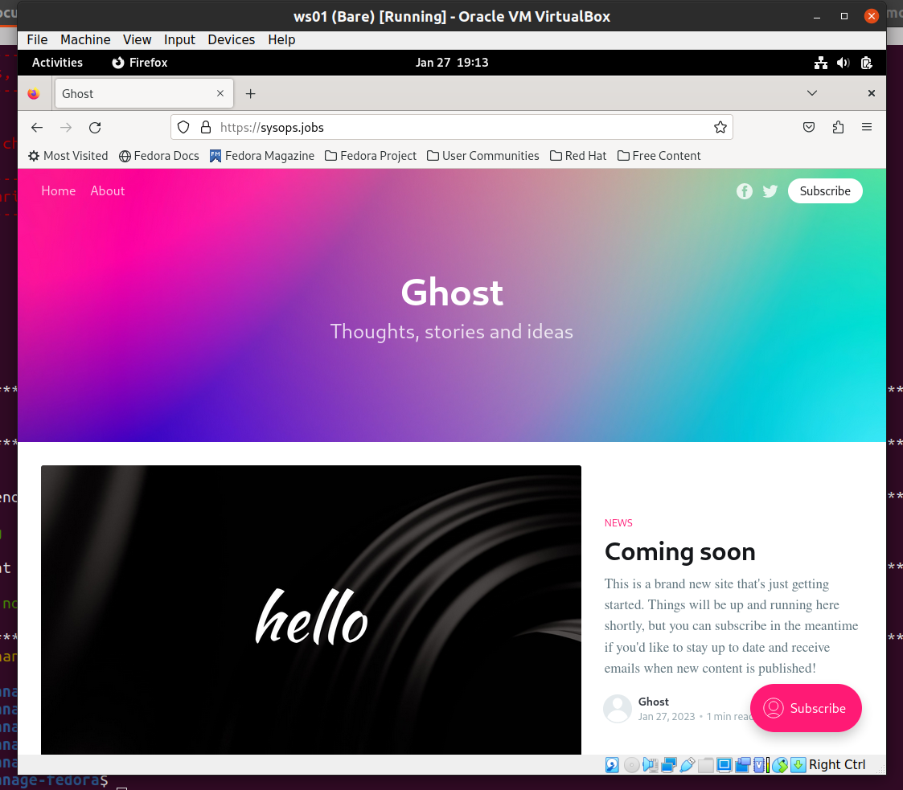
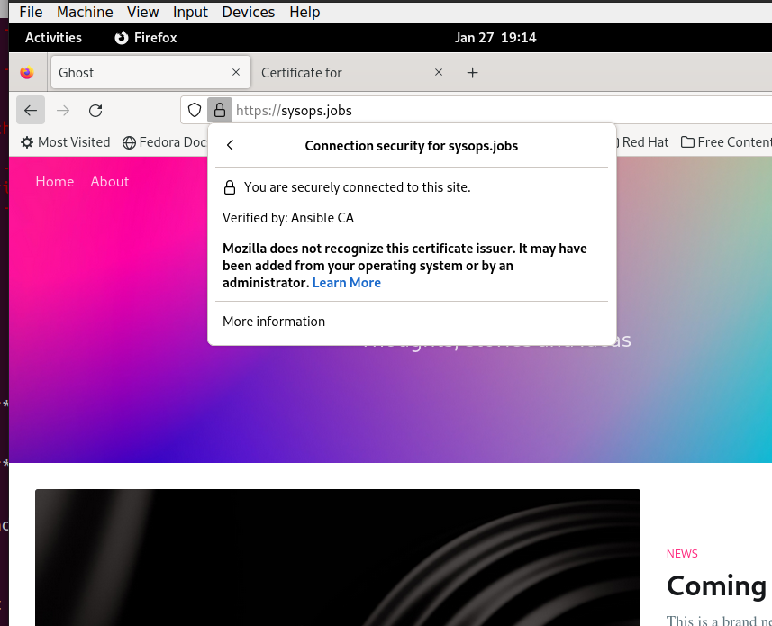

# Manage-Fedora


This repo is all about setting up Fedora workstation with customized requirements.

## Requirements

- **Platforms:**
  - Fedora (Non Air gapped setup)

- **Dependencies:**
  - Ansible >= 2.9.6
  - `community.crypto` package must be installed.

## Installation

Clone the repository to your desired location. 

## Usage

Once inside the ansible directory `manage-fedora`. There are three essential playbooks.
1. users-creation.yml
	- Creates two users i.e. simple user and super user. 
	- Passwordless sudo for superuser.
	- Copies ansible controller's ssh-key to both user's `authorized_keys`
2. install-developer-ws.yml
	 -  Contains following roles:
		   - ssh
		   - packages
		   - firewall 
		   - docker  
		   - nix-install
		   - ghost-install
		   - certificates
		   - haproxy
1. install-plain-ws.yml
	 -  Contains following roles:
		   - ssh
		   - packages
		   - firewall 
		   - docker   
		   - ghost-install 

Edit the `hosts.ini` that is present at `./inventory/hosts.ini` and construct your cluster based on:
1. Place all `developer` hosts under the `developer` group with their corresponding IP Addresses.
2. Place all `plain` hosts (non developers) under the `plain` group.
3. Make sure a group of groups `workstation` is present and add both groups `developer` and `plain` as its children.

#Note `./inventory/hosts.ini` is defined as default host file under `ansible.cfg`

4. Prepare these essentials variables

### Variables

###### 1. Vars inside the playbook

The playbooks `install-developer-ws.yml` require following essential vars:
```
- ws_developer: true          ## Only for install-developer-ws.yml
- ca_authority: true          ## Only define when CA needs to be created
- issue_certificate: true     ## Only define when certificate needs to be issued
```

- Notes:
	- For `install-developer-ws.yml`, the variable `ws_developer` variable must be defined and for `install-plain-ws.yml` it must not (should be commeted out). Based on this variable, additional packages are installed for `devopler` users.
	- The vaiables `ca_authority` must be commented out if certificate authority creation is not desired. Simialry comment out `issue_certificate` if a certificate is not to be issued. Or comment out the role `certificate` which will skip both.

###### 2. Vars for hosts and groups:

- Note: 
	  Under the group of groups `workstation`, following two variables are added. They will be inherited to `devoloper` and `plain` groups and subsequently to all hosts defined under both groups.

```
- super_user: superuser            ##Superuser username
- simple_user: user                ##plain user username
```

- If you want to have any variables specific to any hosts, then create a host file under `./inventory/host_vars` add your host specific variables, they will take precedence. Make sure to include your host under `developer` or `plain` groups.

- Location:
```
./inventory/
├── group_vars
│   ├── developer
│   ├── plain
│   └── workstation
├── hosts.ini
└── host_vars
    └── ws01
```


###### 3. Vars for `ssh` role:

```
local_user_email: mzainali33@gmail.com        ##Email for fail2ban
```

- Location:
```
./roles/ssh/vars/
└── main.yml
```

###### 4. Vars for `packages` role:

Developer packages are installed when `ws_developer` is defined. Comment it out for plain users. 

Add desired packages here.
```
common_system_packages:
- gnome-tweaks
- htop
- keepassxc
- zsh
- fail2ban

developer_system_packages:
- ansible
- code
- fd-find
- fzf
- ish
- mysql-community-server
- vim
- zsh
- yum-utils
- device-mapper-persistent-data
- lvm2

developer_system_packages_group:
- Development Tools
- Development Libraries
```

- Location:
```
./roles/packages/vars/
└── main.yml
```


###### 5. Vars for `firewall` role:

```
source_address: 192.168.0.0/24         ## Define Source IP address to allow ICMP
ports_allow:                           ## ports to allow. Add desired ports
- 443
- 80
- 3306
- 2368
- 8080
```

- Location:
```
./roles/firewall/vars/
└── main.yml
```

###### 6.  Vars `docker` role:

```

include_vars: ../../user_management/vars/main.yml  ## Include vars in user-mgt

docker_packages:

- docker-ce
- docker-ce-cli
- containerd
- docker-compose-plugin
- docker-compose

docker_users:
- "{{ super_user }}"                       ## defined inside the playbook
- "{{ simple_user }}"                      ## defined inside the playbook
```

- Location:
```
./roles/docker/vars/
└── main.yml
```

###### 7. Vars for `nix-install` role

Nix will be installed as plain user.
```
nix_user: "{{ simple_user }}"
nix_group: "{{ simple_user }}"
```

- Location:
```
./roles/nix-install/vars/
└── main.yml
```

###### 8. Vars for `ghost-install` role:

Assign the `image`, `port`, `url`, `mariadB` password etc here.

```
ghost_image: ghost:4-alpine                 ##Chose the image for ghost

ghost_port: 8080                   ##Chose the port for ghost (outside docker)
ghost_url: https://sysops.jobs             ##Chose the url for ghost
ghost_node_env: development                 ##Chose the node_env for ghost

mariadb_image: mariadb:latest               ##Chose the image for mariadb
mariadb_root_password: 80*lG3uY0T           ##Chose the password for mariadb

##path for docker-compose.yml
dir_ghost_docker_compose: /home/{{ simple_user }}/ghost/docker-compose 

## path for ghost/content
dir_ghost_content: /home/{{ simple_user }}/ghost/content/ 

## mariadB docker volume point
dir_mariadb_etc: /home/{{ simple_user }}/mariadb/etc/ 

## mariadB contents /var/lib/mysql
dir_mariadb_content: /home/{{ simple_user }}/mariadb/mysql 

## mariadB docker vol. for log
dir_mariadb_log: /home/{{ simple_user }}/mariadb/log 

ghost_installation_dir:               ##These dirs were defined in main playbook
- "{{ dir_ghost_docker_compose }}"
- "{{ dir_ghost_content }}"
- "{{ dir_mariadb_etc }}"
- "{{ dir_mariadb_content }}"
- "{{ dir_mariadb_log }}"
```

- Location:
```
./roles/ghost-install/vars/
└── main.yml
```

###### 9.  Vars for `certificates`

```
## path to ca directory
ca_host_directory: /home/{{ super_user }}/cert_authority

## path to target host directory for issued(target) certificate
target_host_directory: /home/{{ super_user }}/cert_issuance

domain:
- "DNS:www.sysops.jobs"
- "DNS:sysops.jobs"
- "DNS:*.sysops.jobs"                        ## using wildcard domain
target_cert_name: 'sysops.jobs-certificate.pem'       ## target cert name
trusted_cert_location: /etc/pki/ca-trust/source/anchors/ #Trusted certs location
```

 As stated above under section `1. Vars inside the playbook`, in `certificates` role, the vaiables `ca_authority` must be commented out only if certificate authority creation is not desired. Simialry comment out `issue_certificate` if a certificate is not to be issued. Or comment out the role `certificate` which will skip both. As default they are enabled for in `install-developer-ws.yml` playbook. 

 Location:
```
./roles/certificates/vars/
└── main.yml
```

## Examples

The repo takes the following cluster as an example:

1. `workstation` is a group of groups consisting of both `developer` and `plain` groups.
2. `developer` is a group consisting of one host `ws01`
3. `plain` is a group consisting of one host `wm02`

```
[workstation:children]
developer
plain

  
[developer]
ws01 ansible_host=192.168.100.174

[plain]
ws02 ansible_host=192.168.100.202
```

Use the following commands to run the three playbooks. 

```
ansible-playbook -u root users-creation.yml --limit=ws01 --diff
ansible-playbook -u superuser install-developer-ws.yml --limit=ws01 --diff
ansible-playbook -u superuser install-plain-ws.yml --limit=ws01 --diff
```

- Notes:
	- The playbook `users-creation.yml` must run as root user. The remaning playbooks must run as `superuser` (or the user defined in `super_user` var)
	- Run with `--check` flag to be sure about what the playbook is doing.
	- The variables in the main playbooks can be moved to `workstation`. They were not moved to have more visibility. 
	- Run the playbook against single host using `--limit=<host>` or against group `--limit=<group>` . For example `--limit=ws01` and `--limit=developer`

## Explanation

The playbook takes following actions.

#### Pre-tasks
Following pre-tasks are included in all three playbooks and these are executed at the start.
- Check ansible version >=2.9.6
- Checking that --limit is used

### Roles

Following are all the roles:
1. user_management
2. ssh
3. packages   
4. firewall       
5. docker
6. nix-install
7. ghost-install
8. certificates
9. haproxy
10. deployment-ghost-block

#### Tasks per Role

##### user_management
1. Make sure we have a 'wheel' group
2. Add the '{{ super_user }}' user	
3. Enable passwordless sudo for "{{ super_user }}" user	
4. Set up authorized keys for the "{{ super_user }}" user. 
	- This taks copies ssh public ssh key from the anisble controller node to the target node.
5. Add the '{{ simple_user }}' user
6. Set up authorized keys for the "{{ simple_user }}" use
	- This taks copies ssh public ssh key from the anisble controller node to the target node.

##### packages

1. Upgrade packages
2. Install RPM Fusion repo rpms
3. Install RPM Fusion Nonfree repo rpms
4. Enabling Third party repos "fedora-workstation-repositories"
5. Install Google Chrome repo
6. Enable Google Chrome repo
7. Enable slack repo
8. Install slack repo
9. Enable Docker CE repo
10. Adding MySQL CE repo
11. Enable vscode repo
12. Clean up yum repositories
13. Install common system packages
	- Common packages are installed for both plain group and developers group.
14. Install developer system packages
	- Additional packages are installed for users in developers group.
15. Install the 'Development tools' package group
	- For developer group.
16. Install the 'Development Libraries' package group
	- For developer group.


##### firewall
1.  Adding ssh to drop zone
2.  Setting drop zone as default zone
3.  `add-icmp-block={echo-request,echo-reply}` on drop zone
4.  Allow ICMP `echo-request` to source address = `{{ source_address }}`
5.  Setting drop zone as default zone
6.  Reload firewalld

##### docker

1.  Install docker ce system packages
2.  Starting docker and enabling it on boot
3.  adding users to docker group


##### nix-install
1. invoke sudo to create /nix if it doesnt already exist
2. Nix intallation as `{{ nix_user }}`

##### ghost-install
1.  Installing Ghost. Creating directory structure for ghost and mariadb.
2.  Copying `templates/ghost-docker-compose.yml.j2` to `target host {{ dir_ghost_docker_compose }}/docker-compose.yml`
3.  Starting ghost and mariadb

#Template `ghost-docker-compose.yml.j2`

##### certificates
1.  Create certificate authority dir `{{ ca_host_directory }}`
2.  Create private key with password protection
3.  Create certificate signing request CSR for CA certificate
4.  Create self-signed CA certificate from CSR
5.  Adding CA self signed certificate to trusted certificates `{{ trusted_cert_location }}`
6.  Create certificate authority dir `{{ ca_host_directory }}` on CA
7.  Create certificate dir `{{ target_host_directory }}` on target host
8.  Create private key for new certificate on target host {{ target_host_directory }}
9.  Create certificate signing request (CSR) for new certificate
10.  Sign certificate with our CA
11.  Write target certificate file
12.  Copying new certificates to trusted certificates `{{ trusted_cert_location }}`

##### ssh
1.  Copying `templates/sshd_config.j2` template to `/etc/ssh/sshd_config`
2.  Copy `templates/jail.local.j2` to `/etc/fail2ban/jail.local`
3.  Start and enable `sshd`
4.  Start and enable `fail2ban`

#Template `jail.local.j2` and `sshd_config.j2`

##### deployment-ghost-block

The `deployment-ghost-block` runs following roles as its dependencies. It does not have any explicit tasks. 
```
dependencies:
- role: docker
- role: ghost-install
- role: certificates
- role: haproxy
```

When `deployment-ghost-block` role is set, please skip the roles `docker`, `ghost-install` , `certificates` and `haproxy`. Otherwise it will duplicate the case.

This role can used independently and it will setup ghost from scratch running in a docker environment.
- Ghost in a dockerized environment, with HAproxy

- SSL Certificates are installed



## Frequently asked questions

Please see [FAQ.md][info-faq] for frequently asked questions.

## Thanks

The following excellent people helped massively:

- Anzemazovec

## License

Manage-Fedora is licensed under the [BSD-3-Clause][info-license] license.
Copyright &copy; 2023, Muhammad Zain Ali

[info-build]: https://travis-ci.org/github/GITHUB-ACCOUNT/manage-fedora
[info-contribute]: CONTRIBUTING.md
[info-faq]: FAQ.md
[info-gitter]: https://gitter.im/GITHUB-ACCOUNT/manage-fedora
[info-license]: LICENSE
[info-release]: https://github.com/GITHUB-ACCOUNT/manage-fedora/releases
[info-prs]: https://github.com/GITHUB-ACCOUNT/manage-fedora/pulls

[shield-build]: https://img.shields.io/travis/GITHUB-ACCOUNT/manage-fedora
[shield-gitter]: https://img.shields.io/gitter/room/GITHUB-ACCOUNT/manage-fedora
[shield-license]: https://img.shields.io/github/license/GITHUB-ACCOUNT/manage-fedora
[shield-release]: https://img.shields.io/github/v/release/GITHUB-ACCOUNT/manage-fedora
[shield-prs]: https://img.shields.io/badge/PRs-welcome-brightgreen
